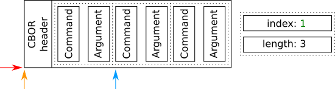
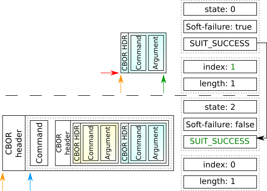

Introduction
============

The introduction of the support for ``suit-directive-try-each`` and ``suit-directive-run-sequence`` commands make it possible to instruct the Software Updates for Internet of Things (SUIT) processor to jump into a different command sequence.
To achieve this, the SUIT processor has to be extended to keep the context of the currently executing sequence, as well as some metadata that will allow it to resume the execution of the sequence that initially requested the jump.

The metadata provides the following information:

1. Value of the ``suit-parameter-soft-failure``.
#. List of component indexes that were selected before the command sequence execution (``current-component-index-list``).
#. Index of the currently processed component (``current-component-index``).
#. Location and size of the command sequence.
#. Pointer to the current command within the sequence.
#. Execution status, which is populated by the child command sequence.
#. Number of commands inside the current sequence.
#. Index of the current command inside the sequence.
#. Command execution state.

Rationale for the metadata fields
---------------------------------

The rationale for each metadata field is provided below.

1. Value of the ``suit-parameter-soft-failure``
```````````````````````````````````````````````

The ``suit-parameter-soft-failure`` is scoped to the enclosing command sequence, as stated in the `SUIT Manifest specification (sec. 8.4.8.15) <https://www.ietf.org/archive/id/draft-ietf-suit-manifest-21.html#name-suit-parameter-soft-failure>`__.
Each command sequence may change the value of this parameter with the ``suit-directive-override-parameters`` directive, so it is necessary to keep a separate value of the parameter for each sequence.

2. List of selected component indexes and the currently processed component
```````````````````````````````````````````````````````````````````````````

The processing of a single directive, if one or more component indexes are selected, should be implemented by calling the directive several times (once for each selected component index) as stated in the `SUIT Manifest specification (sec. 6.5) <https://www.ietf.org/archive/id/draft-ietf-suit-manifest-21.html#name-special-cases-of-component->`__.

.. code-block::

    for current-component-index in current-component-index-list:
        cmd(current-component-index)

The global list of selected components cannot be used.
This is because the nested command sequence is allowed to change the set of selected components at any time and also at any command sequence's nesting level.

Therefore, the SUIT processor has to keep the context of the loop (both ``current-component-index`` and ``current-component-index-list``) for each command sequence.

3. Command sequence and the pointer to the current command within the sequence
``````````````````````````````````````````````````````````````````````````````

The need to include the current pointer within each sequence is due to the fact that any sequence may be paused by either the ``suit-directive-try-each`` or ``suit-directive-run-sequence`` command.

To resume the execution of a sequence, the processor needs to be able to run the ZCBOR parser on the remaining part of the current command sequence.

The information about the current sequence (pointer and length) is needed because whenever a sequence is executed for the next component (see the loop within the code block in the previous paragraph), the execution must start from the beginning of the sequence.

4. Execution status
```````````````````

The main reason for adding the execution status field is the need to control the parent (caller) logic, based on the child (callee) execution result.
There are three types of statuses that must be handled:

* Success
* Command or condition failure (hard)
* Condition failure (soft)

A "success" or "command or condition failure (hard)" may be handled in a generic way, by continuing or aborting the execution of all the command sequences.

A "condition failure (soft)" cannot be implemented in the same way as a "success" or a "command of condition failure (hard)".
This is because it must be interpreted according to the context of the parent sequence.
The following describes the behavior of a "condition failure (soft)":

* If handled inside ``suit-directive-try-each`` then the processor enters the next sequence.
* If handled inside ``suit-directive-run-sequence`` then the processor continues the execution from the first command, after the sequence.

The condition failure cannot be masked while handling the execution status.
It must be interpreted in combination with the ``suit-parameter-soft-failure`` value.
Since the value of ``suit-parameter-soft-failure`` only exists as long as the child sequence is executed, there is a need for a special return status (the "condition failure (soft)"), that will be used if the following conditions are met:

* The child sequence ends with condition failure.
* The ``suit-parameter-soft-failure`` value is set to ``true``

If the conditions above are not met then the "condition failure (hard)" must be interpreted as a regular failure and abort the execution.

5. Index of the current command and the number of commands inside the current sequence
``````````````````````````````````````````````````````````````````````````````````````

The information about the number of entries inside the CBOR list is stored inside the header.
Additionally, the header does not contain information about the expected length (in bytes) of the entries.
The SUIT processor must verify that the execution does not consume more bytes than specified in the list length.
The iteration over commands within the sequence must compare indexes, not the pointer values.

There is some redundancy between the indexes and the remaining data, where the header with the number of entries can be parsed each time by using the pointer to the beginning of the sequence.
The reason for keeping the length of the list is to avoid parsing the CBOR header in each step.

The pointer to the current command cannot be easily calculated through indexing the parsed command sequence list.
This is because the length of each field is unknown.
Doing so would require going through each element of the list, resulting in a quadratic-time complexity in the worst case.

6. Command execution state
``````````````````````````

The command execution state variable was introduced to avoid marking the progress of the command execution through the execution pointer.
The interpretation of this field depends on the command internal logic.
At the beginning of the command execution, this field is initialized to zero.

Execution flow
--------------

The command sequence, scheduled for execution, is encapsulated inside the CBOR list.
The list is interpreted as (command, argument) pairs.
The CBOR encoding scheme reserves at least one byte for the list header.
It contains the ``type`` indicator as well as the number of elements inside the list.

The following figure illustrates the command sequence execution flow:


The following steps explain the execution flow process:

1. The execution pointer is set to the CBOR header at the beginning.
   Once the processor starts to interpret the list, it moves the pointer to the first element in the list.


#. After parsing a single (command, argument) pair, a command handler is called and the return code is collected.

#. If the command succeeds:

   1. The pointer is moved by two elements so that it points to the next command.
   #. The index of the current command is incremented.
   #. At the start of the next iteration, the index is compared with the length of the list.
      If there are more commands to be processed, the interpreter then goes straight to the next (command, argument) pair parsing (part 2).



#. If the command wants to execute a child sequence:

   1. The command implementation modifies its state variable to indicate this action.
   #. A new metadata structure is created and initialized with default values.
   #. It returns a special value (``SUIT_ERR_AGAIN``).
   #. The next sequence execution starts from the beginning of the child's sequence and starts again from reading the number of elements in the list (part 1).
      This is because the interpreter always starts from the topmost metadata.


#. If the child command sequence finishes:

   1. The condition failure status is overridden, based on the ``suit-parameter-soft-failure`` value.
   #. The status is saved in the parent's metadata.
   #. The child's metadata is removed.
   #. The logic returns the special value (``SUIT_ERR_AGAIN``) to start over from the parent's metadata execution pointer.


Example 1: ``suit-directive-run-sequence``
------------------------------------------

To clarify the execution flow, the processing of a single-nested sequence is shown schematically below.


All pointers point to the CBOR list header in the beginning of the process:

* The current command sequence (red arrow).
* The beginning of the sequence (orange arrow).
* The current command within the sequence (blue arrow).


Once CBOR header is parsed:

1. The length of the list is stored inside the metadata on the right side.
#. The current command pointer is moved to the beginning of the first command inside the sequence.


After parsing the (command, argument) pair, a command handler is called.
In this case (``suit-directive-run-sequence``), the command handler:

1. Extracts the nested command sequence.
#. Schedules the nested sequence.
#. Sets its internal state to ``1``.
#. Returns the ``SUIT_ERR_AGAIN`` code to jump to the processing from the child sequence.


The current command sequence is always on top of the stack.
On the next processing iteration it points to the beginning of the child sequence (red arrow).
The processing of the child sequence has not started, so all the pointers are initialized to point to the beginning of the sequence.


Once the CBOR header of the child sequence is parsed:

1. The length of the list is stored inside the metadata on the right side.
#. The current command pointer is moved to the beginning of the first command inside the sequence.


Let's assume that the command inside the child sequence succeeds. In such case:

1. The result of the sequence (``SUIT_SUCCESS``) is passed through the metadata to the parent sequence.
#. The topmost element is removed from the execution stack.


The next iteration of the processor starts again from the ``suit-directive-run-sequence``.
This time the command handler, based on its internal state, does not schedule the child sequence but checks the status field inside the metadata.
The child sequence was finished without an error, so the command handler returns the success status.

On successful command handler execution:

1. The next (command, argument) pair is parsed.
#. The current command pointer is moved to the next command.
#. The current command index is increased.
#. The command state variable is reinitialized.


If the index of the current command has the same value as the length of the command list:

1. The processor checks if the whole command sequence has been processed.
#. The status code from the metadata is returned.

Example 2: ``suit-directive-try-each``
--------------------------------------

The role and the meaning of the ``suit-parameter-soft-failure`` as well as the corresponding metadata fields can be shown using the sequence with the ``suit-directive-try-each`` command.


At the beginning all pointers are initialized in the same way as it is done for the ``suit-directive-run-sequence`` command.


Parsing the CBOR header works the same way as well.


The ``suit-directive-try-each`` command handler uses the same method to pass the execution to the first ``try`` sequence.

1. Extracts the nested ``try`` sequence.
#. Schedules the nested sequence, with ``suit-parameter-soft-failure`` initialized to ``true``.
#. Sets its internal state to ``1``.
   The state will indicate, which ``try`` sequence is scheduled.
#. Returns the ``SUIT_ERR_AGAIN`` code to jump to the processing from the child sequence.


The processing of the nested sequence starts.
Note that at this stage, the ``suit-parameter-soft-failure`` parameter is initialized and must not be reset by the child sequence startup sequence.

.. image:: img/try_04.png

The sequence length is parsed and the pointer to the current command is moved.


Let's assume that the child command sequence failed on the condition check.

1. The processing of the child sequence stops.
#. The result of the sequence (``COND_FAIL``) is combined with the value of ``suit-parameter-soft-failure`` and passed as ``SOFT_COND_FAIL`` through the metadata to the parent sequence.
#. The topmost element is removed from the execution stack.


The next iteration of the processor starts again from the ``suit-directive-try-each``.
The command handler, based on its internal state, expects the return status from the first ``try`` sequence in the metadata.
The value of the status indicates that the sequence failed and that the next ``try`` sequence should be scheduled.
In such case, the command handler:

1. Extracts the next nested ``try`` sequence.
#. Schedules the nested sequence, with ``suit-parameter-soft-failure`` initialized to ``true``.
#. Increases its internal state value.
#. Returns the ``SUIT_ERR_AGAIN`` code to jump to the processing from the child sequence.


The processing of the nested sequence starts.

.. image:: img/try_08.png

The sequence length is parsed and the pointer to the current command is moved.



Let's assume that the second ``try`` command sequence succeeds. In such case:

1. The result of the sequence (``SUIT_SUCCESS``) is passed through the metadata to the parent sequence.
#. The topmost element is removed from the execution stack.


The next iteration of the processor starts again from the ``suit-directive-try-each``.
The command handler, based on its internal state, expects the return status from the second ``try`` sequence in the metadata.
The value of the status indicates that the sequence succeeded and the processing of ``suit-directive-try-each`` cases should be stopped.

On successful command handler execution:

1. The current command pointer is moved to the next command.
#. The current command index is increased.

Next, the index of the current command has the same value as the length of the command list.
The following procedure then takes place:

1. The processor checks if the whole command sequence has been processed.
#. The status code from the metadata is returned.
